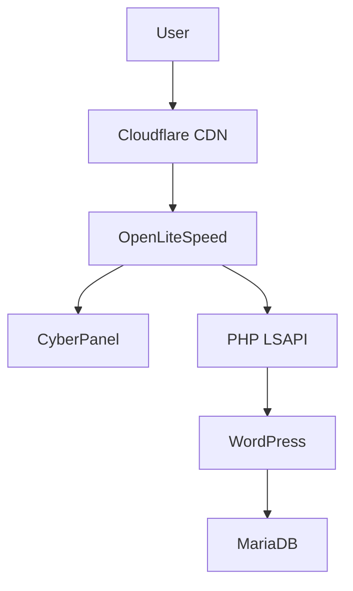

# 🚀 CyberPanel Production Stack

> High-performance DevOps deployment using CyberPanel + OpenLiteSpeed
> Built by **Muhajirin Saad**

---

## 🌍 Project Description

CyberPanel Production Stack is a **complete DevOps solution** designed to deploy, secure, and scale modern web applications using:

* ⚡ OpenLiteSpeed (ultra-fast web server)
* 🔐 Built-in SSL automation
* 🌐 Multi-domain hosting
* 🤖 Automation-ready scripts
* 🛡️ Security hardening

This project is suitable for:

* DevOps Engineers
* Web Developers
* Startup Infrastructure
* Personal Hosting Business

---

## 🧰 Tech Stack

* OS: Ubuntu 22.04 LTS
* Web Server: OpenLiteSpeed
* Panel: CyberPanel
* Database: MariaDB
* Cache: LiteSpeed Cache
* SSL: Let's Encrypt
* Security: UFW, Fail2Ban

---

## 🧱 Architecture Overview



---

## ⚙️ Quick Installation

```bash
chmod +x scripts/install.sh
./scripts/install.sh
```

---

## 🌐 Access Panel

* URL: https://SERVER_IP:8090
* Username: admin

---

## 🚀 Features

✔ One-click CyberPanel install
✔ WordPress auto-deploy
✔ SSL automation
✔ Firewall & Fail2Ban
✔ Backup automation
✔ CI/CD ready

---

## 🔐 Security Features

* SSH hardening
* Fail2Ban intrusion prevention
* Firewall (UFW)
* SSL auto-renew

---

## 📦 Deployment Guide

Check documentation:

* docs/setup-domain.md
* docs/security.md
* docs/optimization.md

---

## 🤖 CI/CD (GitHub Actions)

Auto deploy config available in:

.github/workflows/deploy.yml

---

## 📸 Screenshots

*Add CyberPanel dashboard here*

---

## 👨‍💻 Author

**Muhajirin Saad**
DevOps | Cyber Security | Digital Infrastructure

---

## 🌟 Vision

Building scalable, secure, and independent digital infrastructure for Indonesia 🇮🇩

---

## 📄 License

MIT License
